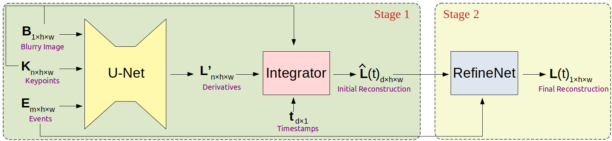

# E-CIR: Event-Enhanced Continuous Intensity Recovery
This repository contains authors' implementation of [E-CIR: Event-Enhanced Continuous Intensity Recovery](https://arxiv.org/abs/2203.01935). Our implementation uses the [PyTorch](https://pytorch.org/) library. We warmly welcome any discussions related to our implementation and our paper. Please feel free to open an issue.

## Introduction
E-CIR consists of an initialization module and a refinement module. The initialization module regresses the polynomial coefficients from the events and the blurry frame. The refinement module further polishes the frame quality by encouraging visual features to propagate across consecutive frames. 



## Environment set-up
Please install [Anaconda](https://www.anaconda.com/distribution/) first and execute the following commands:
```
conda create -y --name e-cir python==3.8.11
conda install -y -q --name e-cir -c pytorch -c conda-forge --file requirements.txt
conda activate e-cir
```

## Dataset set-up
We experimented E-CIR on the [REDS](https://seungjunnah.github.io/Datasets/reds.html) dataset and seven real event captures in [EDI](https://github.com/panpanfei/Bringing-a-Blurry-Frame-Alive-at-High-Frame-Rate-with-an-Event-Camera). Please refer to [REDS\_Dataset.md](REDS_Dataset.md) and [EDI\_Dataset.md](EDI_Dataset.md) for instructions on how to set up these two datasets.

## Training
Please set the arguments in `src/main_reds.py` and run:
```
python src/main_reds.py
```

## Pre-trained weights
You can download our pre-trained weights here: [Google Drive](https://drive.google.com/file/d/11iQRDjnvBcY7YnnXV3VMzwEAmu3g8S_k/view?usp=sharing).

After downloading the weights, move them accordingly so that the directory structure looks like this:
```
<project root>
  |-- data
  |     |-- <data files>
  |-- lib
  |     |-- <source files>
  |-- src
  |     |-- <source files>
  |-- trainers
  |     |-- <source files>
  |-- saved_weights
  |     |-- release
  |     |     |-- checkpoints
  |     |     |     |-- 49
  |     |     |     |    | model_g.pth
  |     |     |     |    | model_r.pth
  |     |     |     |    | optimizer_g.pth
  |     |     |-- log
  |     |     |     |-- events.out.tfevents.1634957528.dgx-4.78772.0
```

## Evaluation
To evaluate the MSE, PSNR, and SSIM on the REDS dataset, please run:
```
python src/main_reds.py --load_dir saved_weights/release/checkpoints/49 --save_dir saved_weights/release
```

This saves the output images to `saved_weights/release/reds_output` and prints quantitative results to stdout.
